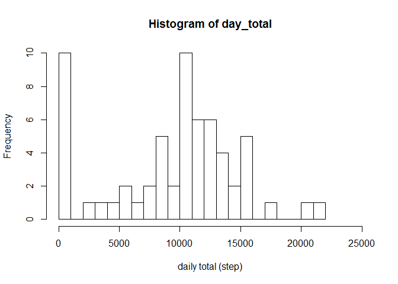

# Reproducible Research: Peer Assessment 1
HCM  
September 19, 2015  


## Loading and preprocessing the data


```r
ped_data<-read.csv("activity.csv")
summary(ped_data)
```

```
##      steps                date          interval     
##  Min.   :  0.00   2012-10-01:  288   Min.   :   0.0  
##  1st Qu.:  0.00   2012-10-02:  288   1st Qu.: 588.8  
##  Median :  0.00   2012-10-03:  288   Median :1177.5  
##  Mean   : 37.38   2012-10-04:  288   Mean   :1177.5  
##  3rd Qu.: 12.00   2012-10-05:  288   3rd Qu.:1766.2  
##  Max.   :806.00   2012-10-06:  288   Max.   :2355.0  
##  NA's   :2304     (Other)   :15840
```

```r
dates<-levels(ped_data$date) #dates recorded
ndays<-length(dates)

message(c("Number of steps taken Over ",ndays," days was recorded every 5 min."))
```

```
## Number of steps taken Over 61 days was recorded every 5 min.
```

## What is mean total number of steps taken per day?

1. Make a histogram of the total number of steps taken each day


```r
day_total<-vector()
for (i in 1:ndays) 
  {
  temp<-subset(ped_data,date==dates[i])
  day_total[i]<-sum(temp$steps,na.rm=T) #na.rm=T replaces all NA with 0
  }
hist(day_total,breaks=25,xlim=c(0,25000),xlab="daily total (step)")
```

 

2. Calculate and report the **mean** and **median** total number of steps taken per day


```r
day_mean<-mean(day_total)
day_median<-median(day_total)
message("The mean and median total number of steps taken per day are ", round(day_mean,0)," and ",round(day_median,0), ", respectively.")
```

```
## The mean and median total number of steps taken per day are 9354 and 10395, respectively.
```


## What is the average daily activity pattern?

1. Make a time series plot (i.e. `type = "l"`) of the 5-minute interval (x-axis) and the average number of steps taken, averaged across all days (y-axis)


```r
#First determin the number of intervals per day, i.e. find the number of 5-min intervals in a day. This should be just 24x60/5=288, but let's verify that from the data
interval_num<-levels(as.factor(ped_data$interval)) #time in minute, every 5 min interval
nintervals<-length(interval_num)
nintervals
```

```
## [1] 288
```

```r
average_alldays<-vector()
for (i in 1:nintervals) 
  {
  temp<-subset(ped_data,interval==interval_num[i]) #subsetting data with the ith interval 
  average_alldays[i]<-mean(temp$steps,na.rm=T) #na.rm=T replaces all NA with 0
}

plot(average_alldays~ped_data$interval[1:nintervals],type="l",xlab="5 min interval number", ylab="average steps taken across all days",main="time series of average steps taken every 5 min across all days",xaxt="n")
points(average_alldays~ped_data$interval[1:nintervals])
axis(1,xaxp=c(0,2400,24),las=2)
```

 

2. Which 5-minute interval, on average across all the days in the dataset, contains the maximum number of steps?

This can be visually determined from the time series plot above, at somewhere between 8 am and 9 am (the interval numbers are structured such that the first digit (or first two digits) represent the hour, and the intervals count up to 55 then advance to the next hour, so 800 and 900 represent 8:00 am and 9:00 am, respectively). But let's find out for sure.


```r
step_max<-which(average_alldays==max(average_alldays))
whenmax<-ped_data$interval[step_max]
whenmax
```

```
## [1] 835
```
So it looks like the maximum occurs around 8:35 am, guess it's time to go to work!


## Imputing missing values

Note that there are a number of days/intervals where there are missing
values (coded as `NA`). The presence of missing days may introduce
bias into some calculations or summaries of the data.

1. Calculate and report the total number of missing values in the dataset (i.e. the total number of rows with `NA`s)


```r
missingsteps<-ped_data$steps[is.na(ped_data$steps)]
length(missingsteps)
```

```
## [1] 2304
```
There are a total of 2304 rows of missing steps. This can also be shown by doing a summary of the data.

2. Devise a strategy for filling in all of the missing values in the dataset. The strategy does not need to be sophisticated. For example, you could use the mean/median for that day, or the mean for that 5-minute interval, etc.


```r
average_by_interval<-rep(average_alldays,61) #add another column containing average for that interval
ped_data_ai<-data.frame(ped_data,average_by_interval)
for (i in 1:length(ped_data$steps))
  { if (is.na(ped_data$steps[i]))
    { ped_data_ai$steps[i]<-ped_data_ai$average_by_interval[i]} #insert average into the NA cell
  }
```


3. Create a new dataset that is equal to the original dataset but with the missing data filled in.

New data set is created in the code above (for bullet 2).

4. Make a histogram of the total number of steps taken each day and Calculate and report the **mean** and **median** total number of steps taken per day. Do these values differ from the estimates from the first part of the assignment? What is the impact of imputing missing data on the estimates of the total daily number of steps?


```r
day_total_ai<-vector()
for (i in 1:ndays) 
  {
  temp<-subset(ped_data_ai,date==dates[i])
  day_total_ai[i]<-sum(temp$steps,na.rm=T) #na.rm=T replaces all NA with 0
}
par(mfrow=c(1,1))
hist(day_total_ai,breaks=25,xlim=c(0,25000),xlab="daily total (step)")
```

 

```r
day_mean_ai<-mean(day_total_ai)
day_median_ai<-median(day_total_ai)
message("The mean and median total number of steps taken per day after replacing missing steps with average of all days for that interval are ", round(day_mean_ai,0)," and ",round(day_median_ai,0), ", respectively.")
```

```
## The mean and median total number of steps taken per day after replacing missing steps with average of all days for that interval are 10766 and 10766, respectively.
```


## Are there differences in activity patterns between weekdays and weekends?


```r
wday<-weekdays(as.Date(ped_data$date))#convert dates to day of the week
ped_dataw<-data.frame(ped_data,wday) #add a column for day of the week to the data


sub_weekend<-subset(ped_dataw,(wday=="Saturday"|wday=="Sunday"))
nrow_weekend<-length(sub_weekend$steps)
sub_weekday<-subset(ped_dataw,(wday!="Saturday"&wday!="Sunday"))
nrow_weekday<-length(sub_weekday$steps)

average_weekend<-vector()
for (i in 1:nintervals) 
  {
  temp_weekend<-subset(sub_weekend,interval==interval_num[i]) #subsetting data with the ith interval 
  average_weekend[i]<-mean(temp_weekend$steps,na.rm=T) #na.rm=T replaces all NA with 0
}

average_weekday<-vector()

for (i in 1:nintervals) 
  {
  temp_weekday<-subset(sub_weekday,interval==interval_num[i]) #subsetting data with the ith interval 
  average_weekday[i]<-mean(temp_weekday$steps,na.rm=T) #na.rm=T replaces all NA with 0
}
```
2. Make a panel plot containing a time series plot (i.e. `type = "l"`) of the 5-minute interval (x-axis) and the average number of steps taken, averaged across all weekday days or weekend days (y-axis). 

(The sample plots have these stacked top/bottom, but on my plots it looks terrible. So I have them side-by-side to show better. It conveys the same information.)


```r
par(mfrow=c(1,2))
plot(average_weekend~ped_data$interval[1:nintervals],type="l",xlab="5 min interval number", ylab="average steps taken across weekend ",ylim=c(0,250))
plot(average_weekday~ped_data$interval[1:nintervals],type="l",xlab="5 min interval number", ylab="average steps taken across weekend ",ylim=c(0,250))
```

 

It looks like the spike around 8:35 am is mainly due to weekend activities, so it's a day for exercise. For weekdays there is less prominent pattern (during the waking hours).

